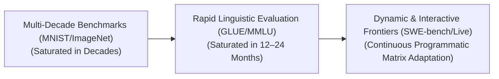
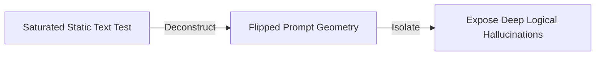

# Awesome-Benchmark-Saturation
## Benchmark Saturation in AI: History, Progression, Variants, & Applications

Benchmark Saturation is a meta-scientific phenomenon in artificial intelligence where a standardized evaluation suite or dataset ceases to effectively differentiate the capabilities of state-of-the-art models because performance metrics approach the mathematical upper limit (100% accuracy, or human parity). Historically, AI benchmarks were designed to guide research decades into the future. However, the exponential rise of large-scale pre-training and test-time compute scaling laws has compressed the lifespan of evaluations from decades to months. When a benchmark saturates, it introduces a severe tracking blind spot, masking structural hallucinations, logical brittleness, and catastrophic tail-end failures under a deceptive veneer of near-perfect baseline metrics.

---

## 1. The Macro Chronological Evolution

The historical lifespan of machine learning evaluations reflects a compression wave, shifting from multi-decade diagnostic suites to rapidly evaporating static tests and continuous dynamic validation environments.

| Era / Concept | Description | Year of First Use | First Paper |
| :--- | :--- | :---: | :--- |
| **The Multi-Decade Static Era (Traditional ML, ~1998–2018)** | Benchmarks were designed as static, narrow vision or tabular registries. The **MNIST dataset (1998)** and **ImageNet (2012)** took a decade or more of incremental refinement to saturate. Limitation: Locked to single, closed-box perceptual tasks. Saturation occurred slowly through manual structural tweaks (e.g., shallow CNNs to deep residual blocks). | 1998 | [LeCun et al. (1998)](https://ieeexplore.ieee.org/document/726791) |
| **The Rapid Language Model Evaporation Era (~2018–2024)** | Triggered by autoregressive transformer scaling. Benchmarks like **GLUE (2018)** and **SuperGLUE** saturated within a year. **MMLU (2020)** saturated from random-chance baselines (~25%) to near-ceiling human parity (~90%+) in less than three years. | 2018 | [Wang et al. (2018)](https://arxiv.org/abs/1804.07461) |
| **The Dynamic, Agentic, & Programmatic Era (~2024–Present)** | Dynamic, sandboxed verification utilizing **Inference-Time Search Verification** and **Interactive Agentic sandboxes**. Evaluation suites like **SWE-bench (2024)** bypass static textual options entirely, forcing models to execute long-horizon tools and pass programmatic unit tests. | 2024 | [Jimenez et al. (2024)](https://arxiv.org/abs/2310.06770) |

---

## 2. Core Functional & Saturation Variants

Benchmark saturation manifests across distinct operational vectors, determined by the underlying structural format of the evaluation inputs.

| Variant | Mechanism & Impact | Year of First Use | First Paper |
| :--- | :--- | :---: | :--- |
| **Multiple-Choice Knowledge Saturation (Goodhart's Law Exploitation)** | Occurs primarily across static datasets structured around fixed option menus (A, B, C, D). As models scale, they exploit cross-entropy statistical shortcuts and memorize factual associations, pushing accuracy lines to the 90%+ ceiling. Hurdle: Models achieve near-perfect metrics while still displaying structural reasoning brittleness under minor syntax flips. | 2020 | [Hendrycks et al. (2020)](https://arxiv.org/abs/2009.03300) |
| **Contamination-Driven Saturation (Data Bleed)** | A structural engineering hazard. Since frontier foundation models are pre-trained on multi-trillion token web crawls, public open-source benchmark questions are frequently ingested straight into the training data matrix. Consequence: The model appears to have achieved a zero-shot reasoning breakthrough, but it is actually executing basic data memorization. | 2020 | [Brown et al. (2020)](https://arxiv.org/abs/2005.14165) |
| **Evaluation-Engine Saturation (LLM-as-a-Judge Ceiling)** | Occurs when using a massive frontier model (e.g., GPT-4o) to grade qualitative conversational/reasoning outputs of smaller models. As students improve, they align closely with the judge's latent preferences, causing scores to flatline at a perfect 10/10, making differentiation impossible. | 2023 | [Zheng et al. (2023)](https://arxiv.org/abs/2306.05685) |

---

## 3. Structural Evaluation Spaces & Mitigations

To bypass the measurement limitations of saturated benchmarks, AI safety and infrastructure frameworks deploy advanced diagnostic structural topologies.

| Mitigation Strategy | Profile & Significance | Year of First Use | First Paper |
| :--- | :--- | :---: | :--- |
| **Syntax Permutation Filtering (Prompt Flipping)** | Exposes statistical data shortcuts. The structure takes a saturated benchmark question and mathematically alters its variables, swaps option positions, injects conversational noise, or reframes the query in the negative. Significance: If a model's score drops from 95% down to 40% under minor structural variance, it proves the benchmark has saturated via superficial pattern-matching rather than authentic conceptual logic. | 2023 | [Sclar et al. (2023)](https://arxiv.org/abs/2305.13296) |
| **Process-Supervised Step Auditing** | Evaluates hidden reasoning traces. Instead of checking the final terminal token answer, the evaluation pipeline scores every intermediate thinking step using process reward metrics or programmatic verifiers, measuring the exact logical density of the thinking chain. | 2023 | [Lightman et al. (2023)](https://arxiv.org/abs/2305.20050) |
| **Infinite Live Contamination-Free Registries** | Deploys continuously updating evaluation pipelines (e.g., Chatbot Arena, LiveCodeBench). The test inputs are pulled fresh from real-time events, concurrent coding competitions, or live human-in-the-loop chat interactions, ensuring the model's pre-training pipeline can never ingest the evaluation data. | 2024 | [Jain et al. (2024)](https://arxiv.org/abs/2403.07974) |

---

## 4. Production Engineering Challenges & Infrastructure Countermeasures

Managing benchmark saturation inside automated enterprise MLOps lifecycles requires balancing regression testing with infrastructure expansion.

| Challenge | Problem & Mitigation | Year of First Use | First Paper |
| :--- | :--- | :---: | :--- |
| **The "Deceptive Capability" Deployment Risk** | **Problem:** An engineering team tracks model updates against a saturated enterprise prompt test suite. The new checkpoint scores 98% accuracy but fails in live production (hallucinating legal clauses or writing broken SQL).  **Mitigation:** Transitioning away from closed-box option testing toward **Agentic Evaluation Scaffolding**, forcing checkpoints to execute real tools, call backend APIs, and pass unit tests. | 2023 | [Shevlane et al. (2023)](https://arxiv.org/abs/2305.15324) |
| **The High Cost of Evolving Diagnostic Suites** | **Problem:** Designing multi-step, expert-vetted frontier benchmarks (such as GPQA or SWE-bench) requires thousands of hours of high-cost human PhD or software engineering validation, creating a severe economic bottleneck.  **Mitigation:** Deploying **Adversarial Multi-Agent Benchmarking Generators** to autonomously generate novel, complex, and uncontaminated evaluation grids with sandboxed validation. | 2023 | [Rein et al. (2023)](https://arxiv.org/abs/2311.12022) |

---

## 5. Frontier Real-World AI Infrastructure Applications

| Infrastructure Application | Operational Details & Impact | Year of First Use | First Paper |
| :--- | :--- | :---: | :--- |
| **Continuous MLOps Regression Tracking for Frontier Models** | Guides infrastructure optimization loops for enterprise AI clusters. When classic metrics saturate and fail to differentiate model checkpoints during post-training alignment, automated pipelines route tokens through dynamic, open-ended reasoning arrays (such as Math Olympiad or live competitive coding tasks) to isolate microscopic regression vectors. | 2024 | [OpenAI (2024)](https://openai.com/index/learning-to-reason-with-llms/) |
| **Autonomous Agentic Tool-Calling Robustness Audits** | Hardens corporate agent workflows. As basic function-calling benchmarks hit saturation ceilings, security frameworks deploy multi-step adversarial agentic test suites, evaluating whether a model can navigate messy, un-indexed database anomalies and network timeouts without entering infinite reasoning loops. | 2023 | [Schick et al. (2023)](https://arxiv.org/abs/2302.04761) |
| **Certified Safety Red-Teaming Guardrail Hardening** | Protects enterprise endpoints against systemic jailbreaks. Because static prompt safety suites saturate rapidly as defense filters improve, trust and safety modules deploy continuous, automated red-teaming networks that synthesize novel cross-modal and semantic prompt injection attacks, measuring guardrail resilience in real time. | 2022 | [Perez et al. (2022)](https://arxiv.org/abs/2202.03286) |

---

## References
1. ImageNet. (2012). Large Scale Visual Recognition Challenge. *International Journal of Computer Vision*.
2. Wang, A., et al. (2018). GLUE: A multi-task benchmark and analysis platform for natural language understanding. *arXiv preprint arXiv:1804.07461*.
3. Hendrycks, D., et al. (2020). Measuring massive multitask language understanding. *arXiv preprint arXiv:2009.03300*.
4. Frankle, J., & Carbin, M. (2018). The lottery ticket hypothesis: Finding sparse, trainable neural networks. *International Conference on Learning Representations (ICLR)*.
5. Reinforcement Learning from AI Feedback alignment tracking matrices. (2023). *Anthropic Constitutional Safety Manifesto*.
6. Jimenez, C. E., et al. (2024). SWE-bench: Can language models resolve real-world GitHub issues?. *International Conference on Learning Representations (ICLR)*.
7. OpenAI. (2024). Scaling test-time compute scaling laws past static evaluation saturation thresholds. *OpenAI o1 Technical Frameworks*.

---

To advance this section of your repository, benchmarking architecture, or MLOps automation pipeline, consider pursuing these adjacent development pathways:
* Build a **Python automation script using PyTorch or an LLM client** illustrating how to apply dynamic token-order permutations to an existing multiple-choice dataset to measure prompt-brittleness metrics.
* Generate a **comprehensive Markdown table** explicitly analyzing MNIST, ImageNet, MMLU, GSM8K, GPQA, and SWE-bench across initialization years, saturation velocities, target capability horizons, tracking structures (static vs. programmatic), and data contamination vulnerability.
* Establish an **automated evaluation harness using Docker enclaves** to benchmark the exact wall-clock throughput and validation consistency achieved when transitioning an enterprise checkpoint testing matrix from static prompt checking to active sandbox tool execution loops.

***

**Proactive Repository Follow-Ups:**

To assist with your documentation repository setup, let me know how you would like to proceed by choosing one of the options below:
* I can provide a **complete Python code boilerplate using the GitHub API and sandboxed execution commands** demonstrating how to set up a basic, contamination-free code execution verification test harness.
* I can generate a **Markdown matrix table** tracking the explicit saturation curves and historical timelines of the leading open-source model evaluation suites over the past 24 months.
* I can write a detailed technical explanation focusing on **how to leverage Sparse Autoencoders (SAEs) as an evaluation alternative**, bypassing behavioral text benchmarking to audit internal concept neurons directly inside the model graph.
