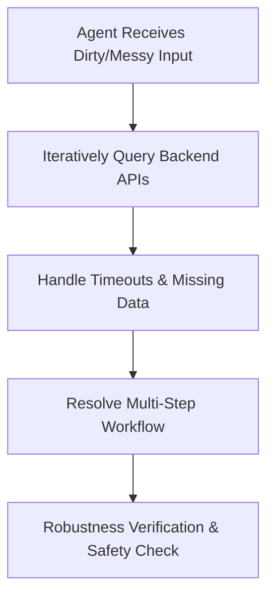

# Autonomous Agentic Tool-Calling Audits

## Overview
Autonomous Agentic Tool-Calling Audits measure a model's ability to operate in messy, real-world execution environments.

## Mechanism & Details
Instead of checking standard syntax matching, audits place models in real-world scenarios with API errors, network timeouts, and database anomalies to evaluate their self-correction and loop prevention behaviors.

## Conceptual Workflow

## Key Characteristics
- **Dynamic Adaptability**: Evaluated continuously against changing distributions.
- **Robustness Target**: Addresses edge-cases and structural failures.
- **Evaluation Paradigm**: Shifting from static validation to interactive systems.

[Back to Main README](../README.md)
