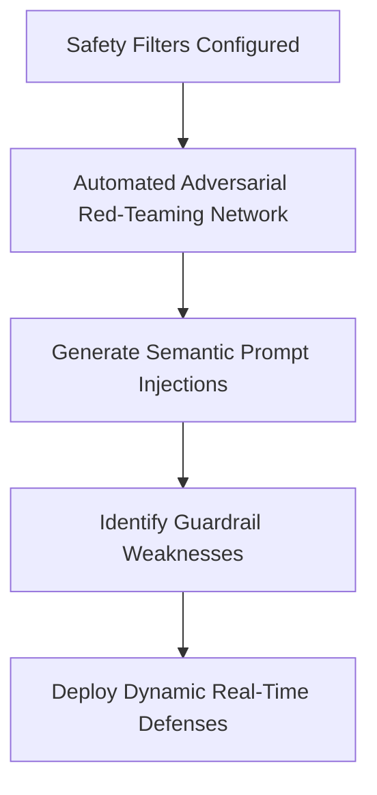

# Certified Safety Red-Teaming Guardrail Hardening

## Overview
Certified Safety Red-Teaming Guardrail Hardening uses adversarial systems to test and harden endpoints against jailbreaks dynamically.

## Mechanism & Details
Because static jailbreak filters degrade quickly, trust and safety frameworks use automated networks to synthesize cross-modal and semantic prompt injections, measuring safety resilience continuously.

## Conceptual Workflow

## Key Characteristics
- **Dynamic Adaptability**: Evaluated continuously against changing distributions.
- **Robustness Target**: Addresses edge-cases and structural failures.
- **Evaluation Paradigm**: Shifting from static validation to interactive systems.

[Back to Main README](../README.md)
