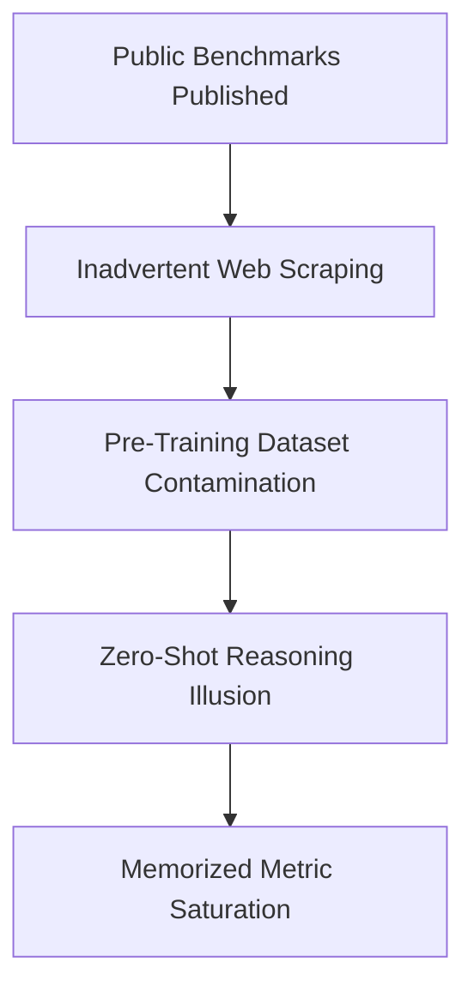

# Contamination-Driven Saturation (Data Bleed)

## Overview
Contamination-Driven Saturation represents a critical data engineering failure where test data leaks into the model's pre-training corpus.

## Mechanism & Details
Since modern models train on web-scale crawls, public benchmarks are frequently indexed and trained on. This results in the model memorizing answers, giving the illusion of reasoning capability.

## Conceptual Workflow

## Key Characteristics
- **Dynamic Adaptability**: Evaluated continuously against changing distributions.
- **Robustness Target**: Addresses edge-cases and structural failures.
- **Evaluation Paradigm**: Shifting from static validation to interactive systems.

[Back to Main README](../README.md)
