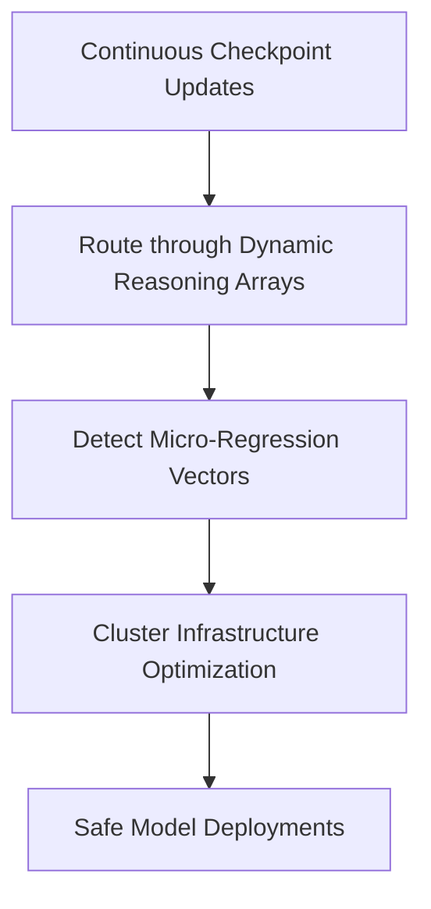

# Continuous MLOps Regression Tracking

## Overview
Continuous MLOps Regression Tracking helps verify model updates across infrastructure clusters using open-ended reasoning checks.

## Mechanism & Details
As standard benchmarks hit performance ceilings, automated MLOps pipelines route model updates through dynamic arrays (e.g. Olympiad Math, Competitive Coding) to identify minor regressions before deployment.

## Conceptual Workflow

## Key Characteristics
- **Dynamic Adaptability**: Evaluated continuously against changing distributions.
- **Robustness Target**: Addresses edge-cases and structural failures.
- **Evaluation Paradigm**: Shifting from static validation to interactive systems.

[Back to Main README](../README.md)
