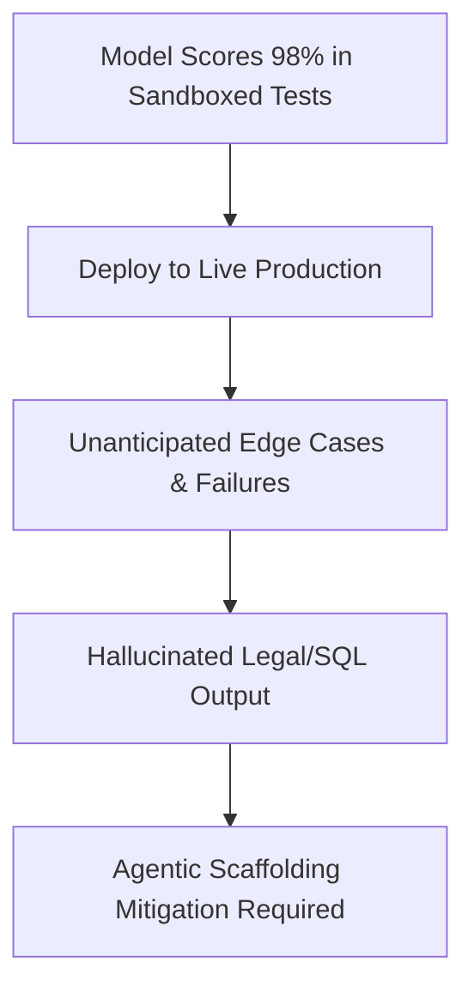

# The Deceptive Capability Deployment Risk

## Overview
The Deceptive Capability Deployment Risk outlines the divergence between high benchmark metrics and failure rates in actual production.

## Mechanism & Details
When a model saturates static benchmarks, teams assume it is production-ready. However, in live production, it encounters tail-end edge cases not covered by shallow test suites, leading to costly hallucination errors.

## Conceptual Workflow

## Key Characteristics
- **Dynamic Adaptability**: Evaluated continuously against changing distributions.
- **Robustness Target**: Addresses edge-cases and structural failures.
- **Evaluation Paradigm**: Shifting from static validation to interactive systems.

[Back to Main README](../README.md)
