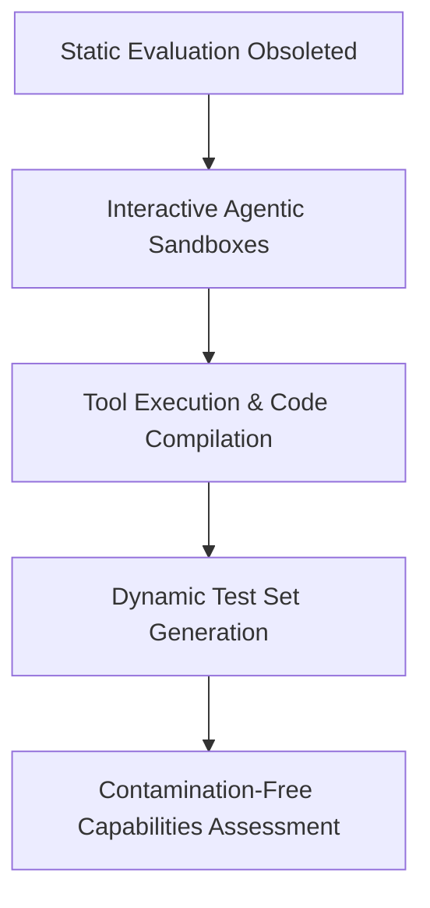

# The Dynamic, Agentic, & Programmatic Era (~2024–Present)

## Overview
The Dynamic, Agentic, and Programmatic Era shifts focus from text choice prediction to live tool usage, sandbox execution, and dynamic test distributions.

## Mechanism & Details
To prevent models from memorizing tests, current frameworks evaluate models as agentic systems. Benchmarks like SWE-bench (2024) require models to resolve GitHub issues in sandboxed environments, verifying solutions with automated unit tests.

## Conceptual Workflow

## Key Characteristics
- **Dynamic Adaptability**: Evaluated continuously against changing distributions.
- **Robustness Target**: Addresses edge-cases and structural failures.
- **Evaluation Paradigm**: Shifting from static validation to interactive systems.

[Back to Main README](../README.md)
