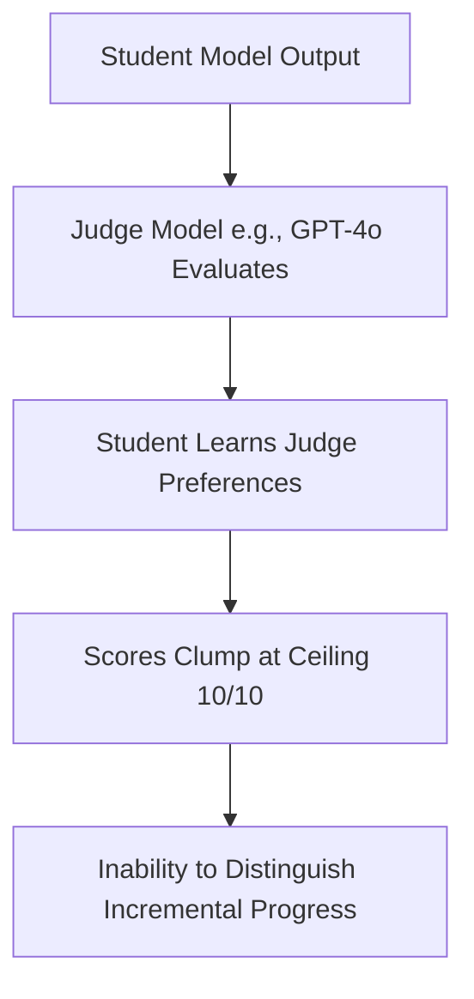

# Evaluation-Engine Saturation (LLM-as-a-Judge Ceiling)

## Overview
Evaluation-Engine Saturation is the flatlining of qualitative scores when a teacher/judge LLM evaluates outputs of student LLMs.

## Mechanism & Details
As student LLMs align to the stylistic preferences of the evaluator model, qualitative grades saturate at the highest bounds. This masks differences in nuance, correctness, and reasoning quality.

## Conceptual Workflow

## Key Characteristics
- **Dynamic Adaptability**: Evaluated continuously against changing distributions.
- **Robustness Target**: Addresses edge-cases and structural failures.
- **Evaluation Paradigm**: Shifting from static validation to interactive systems.

[Back to Main README](../README.md)
