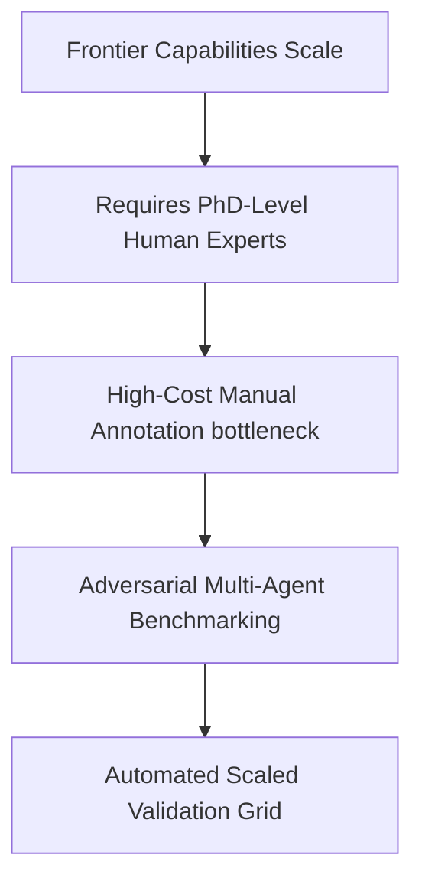

# The High Cost of Evolving Diagnostic Suites

## Overview
This challenge highlights the economic bottleneck of creating expert-level benchmarks manually as AI capabilities outpace human annotation speeds.

## Mechanism & Details
Creating benchmarks like GPQA requires hundreds of PhD hours. To overcome this, developers deploy Adversarial Multi-Agent generators that design, solve, and programmatically verify complex questions at scale.

## Conceptual Workflow

## Key Characteristics
- **Dynamic Adaptability**: Evaluated continuously against changing distributions.
- **Robustness Target**: Addresses edge-cases and structural failures.
- **Evaluation Paradigm**: Shifting from static validation to interactive systems.

[Back to Main README](../README.md)
