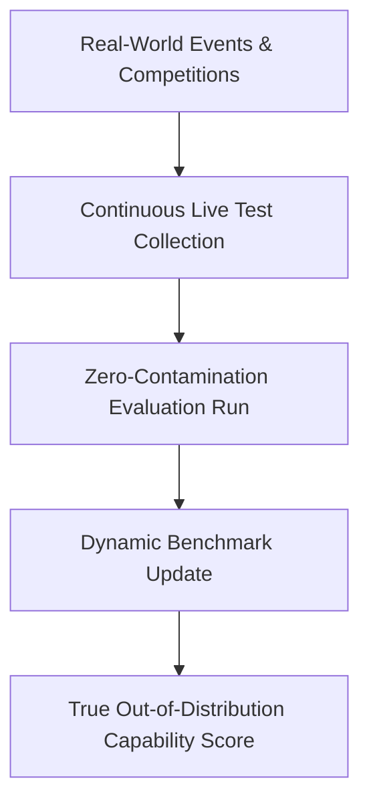

# Infinite Live Contamination-Free Registries

## Overview
Infinite Live Contamination-Free Registries avoid dataset contamination by continuously sourcing test samples from active real-world streams.

## Mechanism & Details
By utilizing live coding challenges, human chat arenas, or new publications, these registries ensure models cannot memorize test answers beforehand, offering a dynamic and accurate capability estimate.

## Conceptual Workflow

## Key Characteristics
- **Dynamic Adaptability**: Evaluated continuously against changing distributions.
- **Robustness Target**: Addresses edge-cases and structural failures.
- **Evaluation Paradigm**: Shifting from static validation to interactive systems.

[Back to Main README](../README.md)
