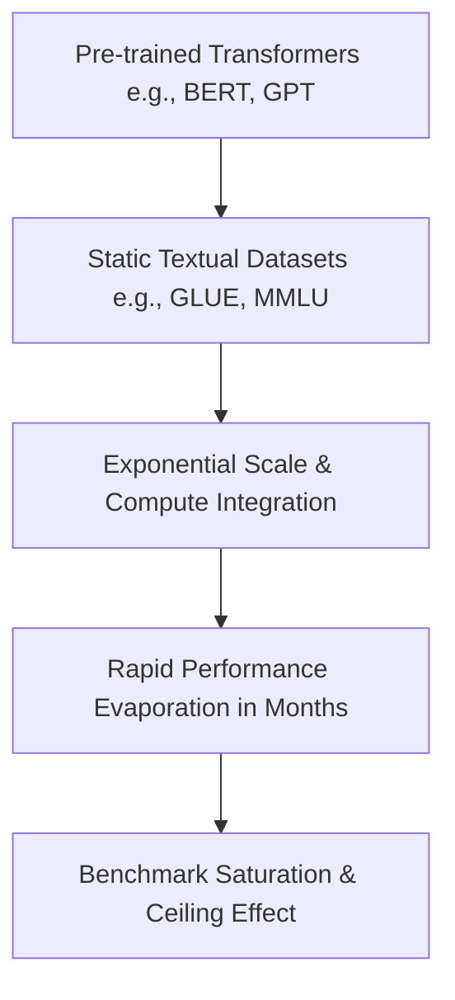

# The Rapid Language Model Evaporation Era (~2018–2024)

## Overview
The Rapid Language Model Evaporation Era was marked by the introduction of large-scale pre-trained transformer architectures, causing static linguistic evaluations to saturate in a matter of months.

## Mechanism & Details
As models scaled in parameters and pre-training data, benchmarks like GLUE (2018) and MMLU (2020) saturated much faster than anticipated. Standard multi-choice benchmarks became ineffective at evaluating new frontier capabilities.

## Conceptual Workflow

## Key Characteristics
- **Dynamic Adaptability**: Evaluated continuously against changing distributions.
- **Robustness Target**: Addresses edge-cases and structural failures.
- **Evaluation Paradigm**: Shifting from static validation to interactive systems.

[Back to Main README](../README.md)
