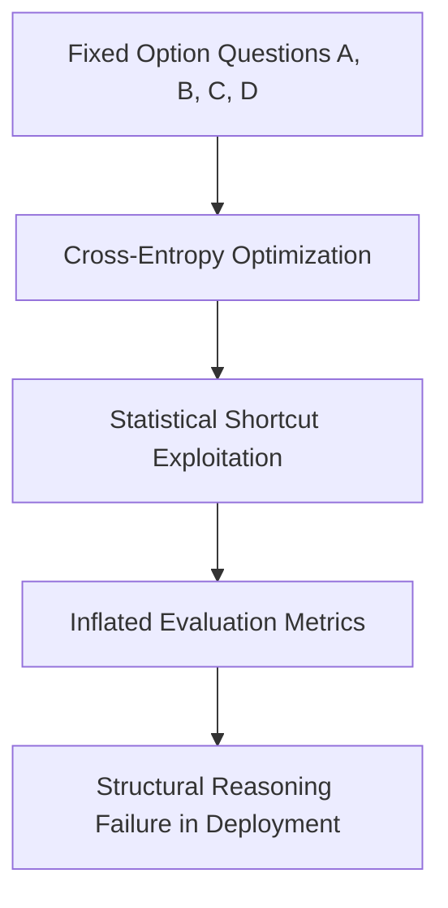

# Multiple-Choice Knowledge Saturation (Goodhart's Law)

## Overview
Multiple-Choice Knowledge Saturation occurs when models learn statistical heuristics or memorize training facts to ace fixed-option tests, masking real-world reasoning brittle behaviour.

## Mechanism & Details
When multiple-choice options (A, B, C, D) are used, models exploit shallow pattern-matching shortcuts. Goodhart's Law states that when a measure becomes a target, it ceases to be a good measure, leading to perfect benchmark scores with poor reasoning.

## Conceptual Workflow

## Key Characteristics
- **Dynamic Adaptability**: Evaluated continuously against changing distributions.
- **Robustness Target**: Addresses edge-cases and structural failures.
- **Evaluation Paradigm**: Shifting from static validation to interactive systems.

[Back to Main README](../README.md)
