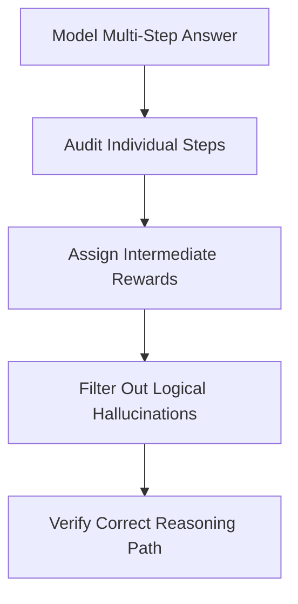

# Process-Supervised Step Auditing (PRMs)

## Overview
Process-Supervised Step Auditing focuses on evaluating the correctness of intermediate reasoning steps rather than just the final answer.

## Mechanism & Details
Instead of checking only the final token, process supervision utilizes Process Reward Models (PRMs) to critique every logical link in a model's chain of thought, successfully identifying logical leaps or hallucinations.

## Conceptual Workflow

## Key Characteristics
- **Dynamic Adaptability**: Evaluated continuously against changing distributions.
- **Robustness Target**: Addresses edge-cases and structural failures.
- **Evaluation Paradigm**: Shifting from static validation to interactive systems.

[Back to Main README](../README.md)
