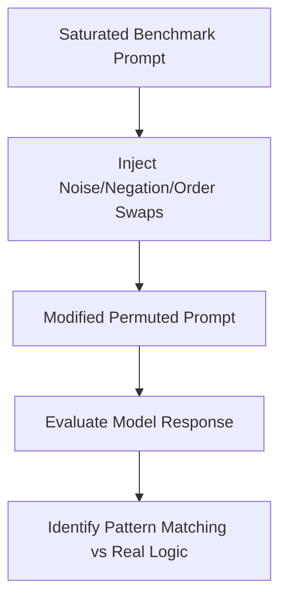

# Syntax Permutation Filtering (Prompt Flipping)

## Overview
Syntax Permutation Filtering, or Prompt Flipping, tests model robustness by introducing non-semantic variations to saturated questions.

## Mechanism & Details
By shuffling multiple-choice options, adding conversational noise, or framing queries in the negative, prompt flipping exposes whether a model has actually generalized or is simply relying on statistical shortcuts.

## Conceptual Workflow

## Key Characteristics
- **Dynamic Adaptability**: Evaluated continuously against changing distributions.
- **Robustness Target**: Addresses edge-cases and structural failures.
- **Evaluation Paradigm**: Shifting from static validation to interactive systems.

[Back to Main README](../README.md)
