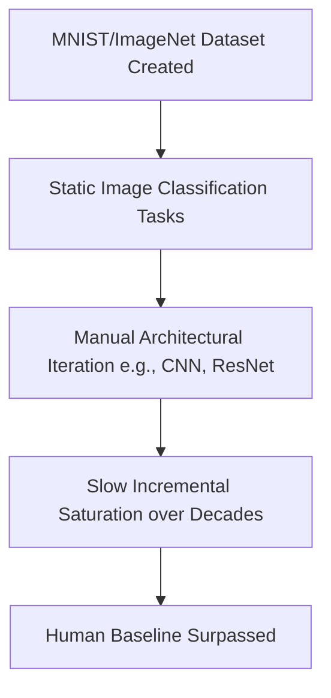

# The Multi-Decade Static Era (Traditional ML, ~1998–2018)

## Overview
The Multi-Decade Static Era represents the early baseline of machine learning evaluation. Benchmarks were built as static, immutable visual or tabular databases, allowing researchers to measure progress over decades.

## Mechanism & Details
In this era, datasets like MNIST (1998) and ImageNet (2012) stood as the definitive golden standards. Because the architecture design space was explored manually, performance gains were incremental, and saturation (reaching human-level accuracy) took 10 to 15 years.

## Conceptual Workflow

## Key Characteristics
- **Dynamic Adaptability**: Evaluated continuously against changing distributions.
- **Robustness Target**: Addresses edge-cases and structural failures.
- **Evaluation Paradigm**: Shifting from static validation to interactive systems.

[Back to Main README](../README.md)
